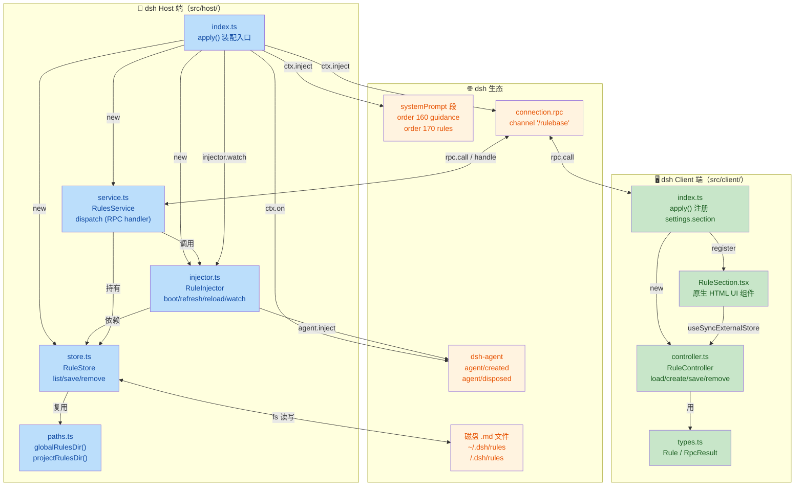
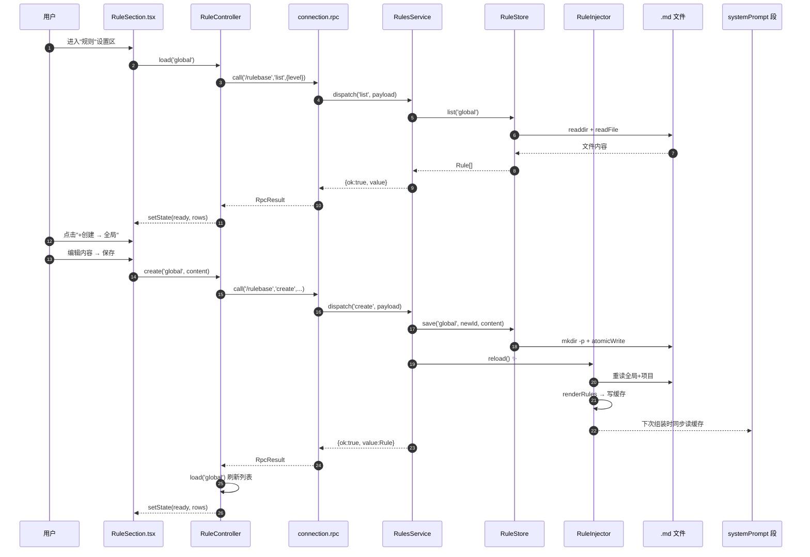

<markdown_report>
# 📋 代码评审摘要：dsh 插件 RuleBase 首次落地

## 1. 🏷️ 高级摘要（TL;DR）

*   **影响：** 🟢 **高** —— 新增一套完整 dsh 插件（host + client + 文档 + 测试），以"全局 + 项目"两级 Markdown 规则文件为源，向系统提示词注入约束，并在 dsh 设置面板提供可视化规则管理界面。
*   **关键变化：**
    *   ✨ **规则即文件**：规则唯一事实源是磁盘上的 `.md` 文件（全局 `~/.dsh/rules/`、项目 `<cwd>/.dsh/rules/`），**不**写 `settings.yaml`、**不**注册 dsh settings 命名空间。
    *   🔌 **三层装配（host）**：`RuleStore`（读写）+ `RuleInjector`（注入/刷新/监听）+ `RulesService`（RPC 桥），由 `src/host/index.ts` 串起。
    *   🎨 **设置面板（client）**：`RuleController`（无 React 依赖的状态机）+ `RuleSection`（原生 HTML + 内联样式）经 `settings.section` 槽注册。
    *   📡 **通信**：用 `dsh-client-connection` 的通用 RPC（`channel='/rulebase'`，`authority='loopback'`），不依赖 Typert Remote。
    *   🔄 **即变即用**：文件监听 + 150ms 防抖 + 缓存重算 + `agent.inject()` 推送"规则已更新"。

---

## 2. 🗺️ 视觉概览（代码与逻辑地图）

---

## 3. 🔍 详细变更分析

### 3.1 📦 依赖与构建（`package.json` / `tsdown.config.ts` / `tsconfig*.json` / `scripts/build-client.mjs`）

*   **新增包 `rulebase@0.1.0`**：type=module，main 指向 `lib/index.mjs`，exports 同时暴露 `.`（host 入口）和 `./client`（client 模块）。
*   **`dsh` 元数据**：声明 `bundle.patch = ./cordis.patch.yml`，`client.platform = web`、`client.inject = ['slots', 'connection']`、`client.immediately = false`。
*   **构建脚本**：
    *   `npm run build` = `tsdown`（host，ESM + d.ts） + `node scripts/build-client.mjs`（client，esbuild 输出 CJS `__ModuleLoader__.load` 包装）。
    *   `npm run typecheck` 对 host/client 两个独立 tsconfig 项目分别检查。
*   **依赖策略**：`peerDependencies` 仅声明 6 个 dsh/cordis 包；`devDependencies` 与之配套。React 19、`esbuild`、`tsdown`、`typescript@5.7` 均为开发态。

| 包 | 角色 | 版本范围 |
|:--|:--|:--|
| `@deepseek-ai/cordis` | 插件运行时 | `>=4.0.1-rc.1 <5` |
| `@deepseek-ai/dsh-system-prompt` | 提示词段合并 | `>=0.0.1-rc.1 <1` |
| `@deepseek-ai/dsh-agent` | agent 生命周期 | `>=0.1.0-rc.1 <1` |
| `@deepseek-ai/dsh-llm` | 消息构造 / MessageSourceMap | `>=0.0.1-rc.1 <1` |
| `@deepseek-ai/dsh-client-connection` | 通用 RPC | `>=0.1.1-rc.2 <1` |
| `@deepseek-ai/dsh-host-apiproxy` | `transportError` 工具 | `>=0.1.1-rc.2 <1` |

*   **环境要求**：`Node >= 22.5`、`engines.node` 显式声明。

---

### 3.2 🏗️ Host 端（`src/host/`）

#### 🎯 `index.ts` —— 装配入口

*   三件套实例化：`RuleStore` / `RuleInjector` / `RulesService`。
*   注册两段系统提示词：
    *   `rulebase:guidance`（`order:160`，静态文本）——保 KV Cache 前缀稳定。
    *   `rulebase:rules`（`order:170`，**动态** `text: (assembleCtx) => injector.renderFromCache(...)`）——**关键细节**：在 `injector.boot()` resolve 后才注册段，规避启动首步缺规则的竞态（P2-5 注释）。
*   注册 RPC：`connection.rpc.handle('/rulebase', service.dispatch, { authority: 'loopback' })`。
*   类型增强：`declare module '@deepseek-ai/dsh-llm'` 扩展 `MessageSourceMap` 添加 `rulebase: { kind: 'rulebase-update' }`。

#### 📂 `paths.ts` —— 路径解析

*   `RuleLevel = 'global' | 'project'`。
*   `globalRulesDir()` → `~/.dsh/rules`。
*   `projectRulesDir(cwd?)` → `<cwd>/.dsh/rules`；`cwd` 缺失返回 `undefined`。

#### 🗄️ `store.ts` —— `RuleStore`

| 方法 | 行为 | 关键细节 |
|:--|:--|:--|
| `constructor(globalDir?)` | 可覆盖全局目录 | 测试隔离用 |
| `list(level, cwd?)` | 全量扫描 `*.md` | `lstat` 过滤软链接；`\r\n`→`\n`；按 id 升序；目录不存在→`[]` |
| `save(level, id, content, cwd?)` | 创建/覆盖 | `mkdir -p` + **原子写**（`<file>.<pid>.tmp` → `rename`） |
| `remove(level, id, cwd?)` | 删除 | 幂等（不存在不抛错） |

*   `MAX_TOTAL_BYTES = 256 * 1024`：由 `RuleInjector` 截断。
*   `titleOf(id, content)`：首个 `# x` H1 → 其文本；无 H1 → 首行截 120 字符；空 → 用 `id`。

#### 💉 `injector.ts` —— `RuleInjector`

*   **缓存模型**：`Map<key, string>`，key = `cwd` 或 `GLOBAL_KEY = '__global__'`。
*   **同步/异步分层**：磁盘 IO 异步（`boot`/`refresh`/`reload`），`renderFromCache` 同步，匹配 `PromptSection.text: (context) => string` 签名。
*   **变更收敛 `reload()`**：
    1. 防重入（`reloadPending`）。
    2. 全局只读一次，复用到所有已知 cwd。
    3. 对每个活动 `Agent` 调 `agent.inject(createUserMessage({content, source: {kind:'rulebase-update'}}))` 推送"规则已更新"。
*   **文件监听 `watch()`**：
    *   启动时监听全局目录。
    *   `agent/created` → 记 cwd、加入 `knownCwds`、监听项目目录、`refresh(cwd)`。
    *   `agent/disposed` → 移除 agent。
    *   `ctx.effect` 在插件卸载时清理 `FSWatcher`。
*   **防抖**：`150ms` 后触发 `reload`，`setTimeout.unref?.()` 不阻塞退出。

#### 🌉 `service.ts` —— `RulesService`

*   `dispatch: ConnectionRpcHandler` 按 `endpoint` 分发；写操作（`create`/`save`/`remove`）成功后**主动**调 `injector.reload()`（`list`/`reload` 除外）。
*   业务异常用 `transportError` 折叠成 `RpcResult{ok:false, error}`。
*   `newId()` = `rule-<Date.now().toString(36)>`。

**RPC 端点表**（`/rulebase` 通道下）：

| endpoint | payload | 业务返回值 | 副作用 |
|:--|:--|:--|:--|
| `list` | `{level, cwd?}` | `Rule[]` | — |
| `create` | `{level, content}` | `Rule`（host 生成 id） | `injector.reload()` |
| `save` | `{level, id, content}` | `Rule` | `injector.reload()` |
| `remove` | `{level, id}` | `void` | `injector.reload()` |
| `reload` | `{}` | `{count: number}`（全局规则数） | 显式重载 + 刷新 |

---

### 3.3 🖥️ Client 端（`src/client/`）

#### 📐 `types.ts` —— 最小类型

*   与 host 同构：`Rule`/`RuleLevel`/`RpcError`/`RpcResult<T>`。
*   **设计意图**：不 import `@deepseek-ai/*`，保持 client bundle 纯净、纯 JSON。

#### 🎮 `controller.ts` —— `RuleController`

*   **状态机**：`{status:'loading' | 'ready', rows | 'error', error}`。
*   **外部 store 接口**：`getSnapshot` / `subscribe` 供 React `useSyncExternalStore`。
*   **方法**：`load` / `reload` / `create` / `save` / `remove`，成功后统一 `load(level)` 刷新列表，返回 `boolean` 表示 `res.ok`。
*   **无 React 依赖**，便于单测。

#### 🎨 `RuleSection.tsx` —— 设置面板"规则"区

*   **5 个内部状态**：`level` / `editing`（含 `id: string | null` 区分新建 vs 编辑）/ `confirmDeleteId` / `createMenuOpen` / `busy`。
*   **交互映射**（详见 [docs/api/07](docs/api/07-设置面板UI组件.md)）：

| 用户操作 | 行为 |
|:--|:--|
| 「刷新」 | `controller.reload(level)` |
| 「+ 创建」→ 全局/项目 | 切换 `level` + 进入新建编辑态 |
| tab 切换 | `setLevel` → `useEffect` 触发 `load` |
| 列表项双击 / 菜单"编辑" | `editing = {id, content}` |
| 设置按钮 `⋮` | 展开"编辑/删除"下拉 |
| 编辑框"保存" | `create`（id=null）或 `save`（覆盖） |
| 删除确认"删除" | `controller.remove` |

*   **样式**：纯原生 HTML + `style` 对象（22 个 `CSSProperties`），**不** import dsh UI primitives。
*   `RuleRow` 子组件：每行 `useState(open)` 局部管理 `⋮` 菜单开合。

#### 🪪 `index.ts` —— 客户端入口

*   `inject = ['slots', 'connection']`（与 `package.json` 的 `dsh.client.inject` 一致）。
*   绑定 channel：`/rulebase` → `RuleRpc`。
*   注册 `settings.section`：`id: 'rulebase'`, `order: 30`, `label: () => '规则'`, `inject: () => ({ controller })`。

---

### 3.4 🧪 测试（`tests/smoke.test.ts`）

*   **Node 自带 `node:test`** 跑 `.ts`（需 tsx/loader，本配置未显式说明）。
*   3 个用例：
    1. `RuleStore` 全量读写 + 覆盖 + 删除（`mkdtemp` 隔离）。
    2. 目录不存在 → 返回 `[]`。
    3. `projectRulesDir` 路径解析（`'/p'` → `/p/.dsh/rules`，`undefined` → `undefined`）。
*   **覆盖不足**：`RuleInjector` 缓存/监听/`reload` 防重入、`RulesService` RPC 分发、UI 组件均**未**单测。

---

### 3.5 📚 文档与设计

*   **`README.md`**：总览 + 安装 + 目录结构 + 脚本表。
*   **`docs/API文档.md` + `docs/api/01..07`**：7 份分模块 API 文档（paths/store/injector/service/host/client/UI），均带类型签名、方法说明、设计要点。
*   **`.trae/documents/`**：3 份设计/审核文档（v001 设计方案 + v001/v002 审核报告）。
*   **`.trae/rules/`**：6 份工程规范（git 提交、命名、禁删、存储位置、测试路径、统一管事）。

---

## 4. ⚠️ 影响与风险评估

### 4.1 🚨 潜在风险

| 风险 | 说明 | 建议 |
|:--|:--|:--|
| 🐛 **首步竞态** | `rulebase:rules` 段在 `boot()` 之后才注册，**用户首次组装时该段不存在** | 已通过 `void injector.boot().then(...)` 处理，但需在 `coreInject` 装配流程确认 `systemPrompt` 段注册时机是允许异步的 |
| 🪟 **Windows `fs.watch` 不可靠** | 非递归、事件可能丢失/合并 | 文档已注明"极端情况由下次 `refresh` 重扫兜底"，建议加 metric/日志监控 |
| 🔗 **软链接安全** | `lstat` 过滤符号链接但 `fs.readdir` 仍枚举 | 当前安全读取仅对平铺 `.md` 有效；若规则目录有子目录，行为需明确（现状：被 `name.endsWith('.md')` 隐式过滤） |
| 📝 **`id` 冲突** | `save` 接受任意 `id`，`newId` 仅靠 `Date.now().toString(36)` | 同一毫秒内多次 create 可能撞 id；UI 创建走 host 生成 id 较安全，外部 `save` 需 UI 端避免重复 id |
| 🧪 **测试覆盖薄** | 仅 `RuleStore` + 路径解析；`Injector`/`Service`/`Controller`/`UI` 缺单测 | 建议补充：缓存命中回退、debounce 防抖、RPC 信封、UI 状态机 |
| 🆔 **`newId` 不可预测** | `Date.now().toString(36)` 可被推测；不构成安全风险（本地文件）但不便排序 | 可考虑追加随机后缀 |
| 🧹 **文件锁** | `atomicWrite` 用 `<file>.<pid>.tmp`，多进程并发写同一文件最后一个 `rename` 赢 | 一般场景无问题；并发写需注意 |
| 📦 **`peerDependencies` 与 cordis 4 范围** | 范围 `<5`，但 5.x 出现时行为可能 break | 暂无 dsh 5.x 计划，OK |
| 🪞 **`asString` 容错** | `controller.create` 即使 `content` 为空也走 RPC；host 接收后存为 `''` 文件 | 需 UI 层在保存前校验非空（或 host 端 throw） |
| 🖱️ **UI `busy` 粒度** | 单一 `busy` 标志，所有按钮共享；并发操作（多个 tab 快速切换）会互相阻塞 | 简单场景可接受 |

### 4.2 🔄 破坏性变化

*   **无外部 API 破坏**：本提交为**首次落地**（所有文件 `new file mode 100644`），无既有代码/接口可破坏。
*   **新引入的 RPC 契约 `/rulebase`**：定义了 5 个 endpoint，下游消费者（未来其他插件）若使用需遵循 `RpcResult` 信封。

### 4.3 ✅ 测试建议

*   **端到端注入**：启 dsh → 新建项目 → `.dsh/rules/foo.md` 写一条规则 → 验证下一次模型请求的系统提示词包含「### 全局规则 / ### 项目规则」段。
*   **多 cwd 场景**：先后在不同 cwd 启动会话，验证每个会话的项目规则独立。
*   **UI 流**：双击编辑 → 改标题 → 保存 → 列表立即刷新；删除确认；"+ 创建"下拉；tab 切换；并发刷新。
*   **异常路径**：
    *   `~/.dsh/rules` 不存在 → 不报错，全局规则为空。
    *   软链接 `bar.md → /etc/passwd` → 跳过，不读。
    *   极大单文件 → 截断提示。
    *   `cwd` 缺失 → project 段渲染为空（不报错）。
*   **监听**：`vim` 编辑规则文件（write 临时文件 + rename） → 触发 `reload`；150ms 防抖。
*   **`agent.inject`**：在长对话中保存规则，验证"规则已更新"user 消息被注入且不打断当前轮。
*   **RPC 信封**：host 端 throw → client 收到 `{ok:false, error:{code:'internal', message}}`。
*   **卸载清理**：`ctx.effect` 关闭所有 `FSWatcher`、清除 `debounceTimer`、清空 `activeAgents`/`knownCwds`/`cache`/`watchers`。

---

## 5. 🎯 总评

*   **设计清晰度**：⭐⭐⭐⭐⭐ —— 分层（paths / store / injector / service / client）职责单一，同步/异步边界明确，文档完备。
*   **可测性**：⭐⭐⭐ —— `RuleStore` 可单测；`Injector`/`Service` 需 mock `Context`/`Agent`；UI 缺单测。
*   **安全性**：⭐⭐⭐⭐ —— 软链接过滤、原子写、目录作用域。
*   **可扩展性**：⭐⭐⭐⭐ —— 新增端点 / 新增规则级别仅需扩展 `paths.ts` + `RuleLevel`；UI 控件无耦合。
*   **风险等级**：🟢 **低**（首次落地，但建议补齐 Injector/Service/Controller 单测）。