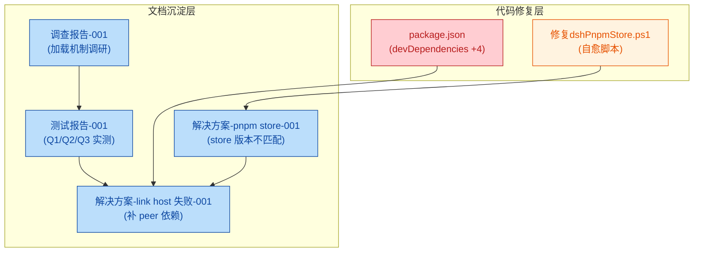
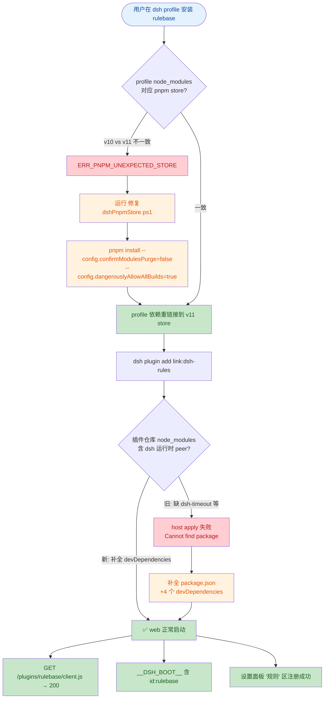
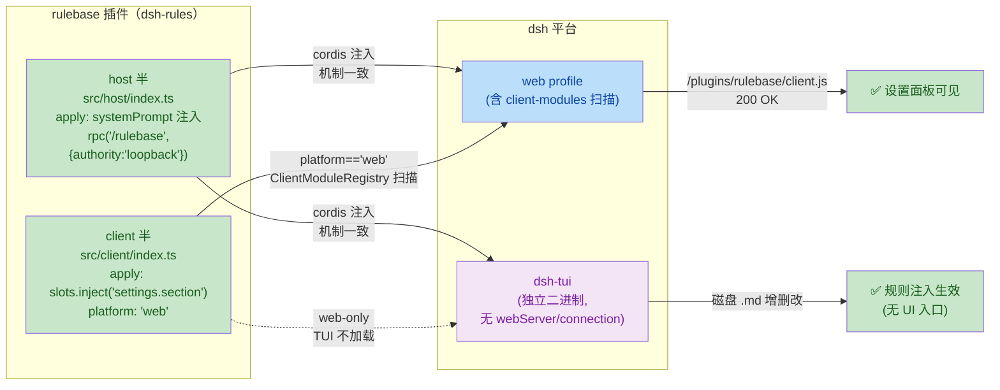

## 1. 高层摘要 (TL;DR)

*   **影响程度：** 🟡 **中等**
*   **范围说明：** 修复 dsh-rules 插件在 `link:` 模式下因缺失 dsh 运行时 peer 依赖导致的 host 加载失败；新增 pnpm store 自愈脚本；并沉淀 4 篇技术文档（调研/测试/方案）。
*   **关键变更：**
    1. ✨ **`package.json` devDependencies 补全**：新增 `@deepseek-ai/dsh-attachment` / `dsh-brand` / `dsh-invariants` / `dsh-timeout` 四个 `^0.0.1-rc.1` 依赖，仅 `dev` 声明、不入发布 tarball。
    2. 🐛 **修复 link 安装 host 报错**：`Cannot find package '@deepseek-ai/dsh-timeout'` 根因消除（dev 时链接到插件自身 `node_modules` 的 peer 解析问题）。
    3. 🛠️ **新增 `修复dshPnpmStore.ps1`**：一键修复 profile pnpm store（v10→v11）不匹配，并以 `link:` 方式安装 rulebase 插件；幂等可重跑。
    4. 📚 **新增 4 篇 `.trae/documents/*.md` 文档**：调查、测试、方案三视角闭环。

---

## 2. 可视化总览 (代码与逻辑图)

### 2.1 变更全景（按文件角色分组）

### 2.2 业务流：用户从"插件装不上"到"成功启动"

### 2.3 架构视图：rulebase host/client 双半与 dsh 平台的关系

---

## 3. 详细变更分析

### 3.1 🐛 核心代码修复：`package.json` 补全 devDependencies

**源文件：** `package.json`

**变更动机：** `link:` 安装场景下，插件仓库的 `node_modules/@deepseek-ai/dsh-llm/lib/index.js` 运行时导入 `@deepseek-ai/dsh-timeout` 等 peer 包。rulebase 仓库原 `devDependencies` 集合过小，无法解析 dsh-llm 声明的 4 个运行时 peer → host 半 `loader-isolation` apply 失败 → web 启动报错、设置项不注册。

**依赖变更表：**

| 新增包 | 版本 | 角色 | 是否入 tarball |
|:--|:--|:--|:--|
| `@deepseek-ai/dsh-attachment` | `^0.0.1-rc.1` | dsh-llm 运行时 peer | ❌（仅 dev） |
| `@deepseek-ai/dsh-brand` | `^0.0.1-rc.1` | dsh-llm 运行时 peer | ❌（仅 dev） |
| `@deepseek-ai/dsh-invariants` | `^0.0.1-rc.1` | dsh-llm 运行时 peer | ❌（仅 dev） |
| `@deepseek-ai/dsh-timeout` | `^0.0.1-rc.1` | dsh-llm 运行时 peer | ❌（仅 dev） |

> **关键点：** 这些新增依赖**只进入 devDependencies**，不进入发布 tarball（`package.json` 的 `files` 字段仅含 `lib/`、`cordis.patch.yml`、`README.md`），因此发布态安装不受影响。

---

### 3.2 🛠️ 新增自愈脚本：`修复dshPnpmStore.ps1`

**源文件：** `.trae/documents/scripts/修复dshPnpmStore.ps1`（新增 50 行）

**功能概览：**

| 步骤 | 行为 | 关键参数 |
|:--|:--|:--|
| 1️⃣ 定位 profile 目录 | 拼接 `$DshHome/profiles/<Profile>` 并校验 `package.json` 存在 | 默认 `web` |
| 2️⃣ 修复 pnpm store | 在 profile 目录内执行 `pnpm install` | `--config.confirmModulesPurge=false` `--config.dangerouslyAllowAllBuilds=true` |
| 3️⃣ 安装插件 | `dsh plugin --profile <Profile> add link:<PluginDir>` | 可 `-SkipAddPlugin` 跳过 |
| 4️⃣ 校验 | 读取 `package.json` 确认 `dsh.profile.bundles` 与 `dependencies` 均含 `rulebase` | 失败即非零退出 |

**参数表：**

| 参数 | 类型 | 默认值 | 说明 |
|:--|:--|:--|:--|
| `-Profile` | string | `web` | dsh profile 名 |
| `-PluginDir` | string | `O:/mcpFs/dsh-plugin-build/dsh-rules` | rulebase 仓库绝对路径 |
| `-DshHome` | string | `G:\SOFTAI\deepseek-harness\Admin\.dsh` | dsh Home |
| `-SkipAddPlugin` | switch | `false` | 仅修 store、不装插件 |

**幂等性：** 已在真实环境重跑验证，二次执行均报 `Already up to date`。

---

### 3.3 📚 新增技术文档（4 篇）

| 文档路径 | 行数 | 角色 | 关键结论 |
|:--|:--|:--|:--|
| `.trae/documents/调查报告：dsh插件规则库web与tui加载问题-001.md` | 139 | 机制调研 | host 半 web/tui 机制一致；client 半 web-only（TUI 无设置面板属预期） |
| `.trae/documents/测试报告：dsh插件规则库实际安装测试-001.md` | 112 | 实测验证 | Q1 安全/Q2 三种安装路径实测/Q3 TUI 结论 |
| `.trae/documents/解决方案：dsh profile pnpm store版本不匹配的修复与规则库安装-001.md` | 81 | 工具链方案 | pnpm store v10→v11 重链接方案 |
| `.trae/documents/解决方案：dsh插件规则库link安装host加载失败的修复-001.md` | 77 | 代码修复方案 | devDependencies 补 4 peer |

#### 3.3.1 测试报告核心结论（Q1/Q2/Q3）

| 测试项 | 结论 | 验证手段 |
|:--|:--|:--|
| **Q1** 空目录/空文件/空规则 | ✅ 启动安全；**不**自动创建空目录/空文件（写端 save 时才创建） | `tests/smoke.test.ts` 3/3 通过 + `rbtest` 隔离 profile 实测 |
| **Q2-A** `link:` 安装 | ⚠️ 旧版 host apply 失败（缺 `dsh-timeout`） | 复现用户症状 |
| **Q2-B** tarball 安装 | ⚠️ `ERR_PNPM_NO_MATCHING_VERSION`（镜像 `tencent.com/npm` 仅有 rc 版） | — |
| **Q2-C** 发布态安装 | ✅ host 无报错、client.js 返回 200、`__DSH_BOOT__` 含 `id:"rulebase"` | 模拟真实 bundle |
| **Q3** TUI 规则管理 | ✅ 终端直接增删改 md；host 注入平台无关 | 机制级结论（web host apply 已通过支撑） |

#### 3.3.2 调查报告核心结论（host/client 平台差异表）

| 能力 | web | tui (dsh-tui) |
|:--|:--|:--|
| systemPrompt 规则注入 | ✅ | ✅（同 host 机制） |
| 规则文件读写（磁盘） | ✅ | ✅（无 UI 入口） |
| 设置面板「规则」区 | ✅ | ❌（client web-only） |
| `/rulebase` RPC 管理通道 | ✅（需 connection/webServer） | ❌（TUI 无 webServer/connection） |

> 关键澄清：web 与 tui 注入**机制一致**；差异来自 client/UI 按平台分档（rulebase 声明 `dsh.client.platform:'web'`）。

---

## 4. 影响与风险评估

### 4.1 ✅ 收益

*   **开发体验：** `link:` 安装下插件可正常 apply，调试链路打通。
*   **可维护性：** 提供幂等的 PowerShell 脚本，未来遇到 pnpm store 跨版本场景一键修复。
*   **知识沉淀：** 4 篇文档形成"调研→测试→方案"闭环，便于团队复用。

### 4.2 ⚠️ 风险与注意事项

| 风险点 | 描述 | 缓解建议 |
|:--|:--|:--|
| **发布 tarball 完整性** | `package.json` `files` 字段需继续仅含 `lib/`、`cordis.patch.yml`、`README.md`；新增 4 个 devDeps **不应**进 tarball | 已有 `files` 配置保护；建议 CI 校验 |
| **新增 dsh 运行时 peer** | 后续若 dsh-llm 升级并新增 peer，rulebase `link:` 模式可能再次失效 | 文档 §4 已留指引：按同法补 devDeps |
| **`authority: 'loopback'` 部署** | `/rulebase` 通道仅放行 `localhost/127.*/[::1]`，LAN IP 访问将 403 | 当前仅本机访问保留现状；若需 LAN 改 `trusted-host` |
| **TUI 规则管理入口** | TUI 不加载 client 半，无规则管理 UI | 当前"终端直接编辑 md"已满足；后续可按需提供 CLI 命令 |
| **package.json 修改位于 plugin 仓库** | 实际生效的是 `O:/mcpFs/dsh-plugin-build/dsh-rules/package.json`（非 `deepseek-harness` 仓库的 package.json） | 关注插件仓库版本控制一致性 |

### 4.3 🧪 评审/测试建议

1. **复现 `link:` 场景：** 在 `rbtest` 隔离 profile 上重跑 `dsh plugin --profile rbtest add link:.../dsh-rules`，确认无 `failed to apply` 报错。
2. **验证设置面板：** 启动 `dsh --profile web`，浏览器打开设置 → 确认「规则」区存在并可保存/删除 md。
3. **客户端加载：** DevTools 检查 `window.__DSH_BOOT__` 是否含 `id:"rulebase"`，并抓取 `GET /plugins/rulebase/client.js` 确认 200。
4. **空路径边界：** 删除 `~/.dsh/rules` 与 `.dsh/rules` 后启动，确认不自动创建空目录；通过 UI 保存一次后确认 `mkdir recursive` 触发。
5. **脚本幂等：** 在 `web` profile 上重跑 `修复dshPnpmStore.ps1`（含/不含 `-SkipAddPlugin`），确认均为 `Already up to date`。
6. **TUI 实测（如可能）：** 启 `dsh-tui --profile <含 rulebase 的 tui profile>`，编辑 `~/.dsh/rules/*.md` 观察 systemPrompt 注入实时变化（机制级验证）。

---

> **变更类型概览：** 1 文件小改（`package.json` +4 devDeps）+ 1 文件新增（PowerShell 脚本 50 行）+ 4 篇 Markdown 文档新增（共 409 行）。**总影响范围：插件开发态 link 链路 + 部署工具链 + 团队知识库。**