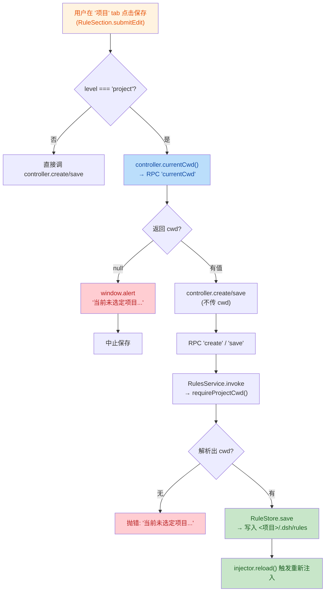
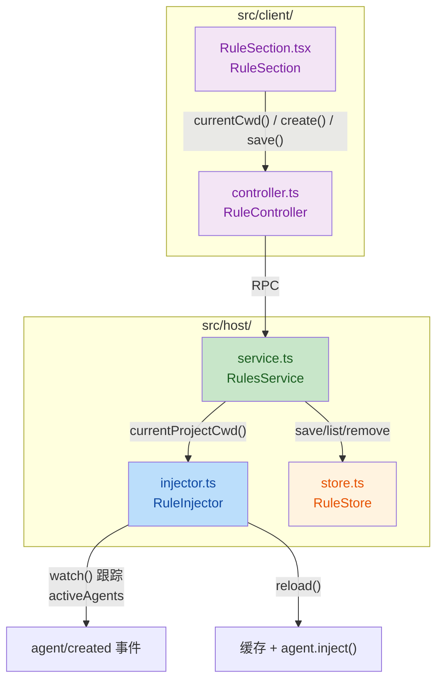
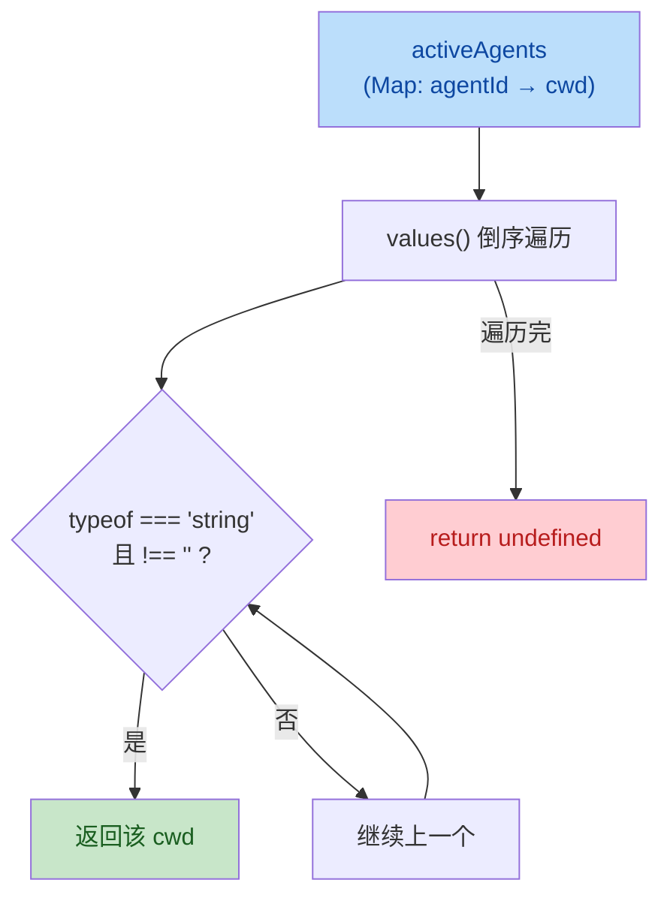

<markdown_report>
# 代码评审报告：dsh 插件项目规则未选项目无法保存的修复

## 1. 高级摘要（TL;DR）

*   **影响**: ⚠️ **中** — 修复「未开对话时无法保存项目规则」的用户体验问题，引入「当前项目」概念到 host/client 两侧。
*   **关键变更**:
    *   ✨ **新增 `currentCwd` RPC 端点**：host 暴露「最近活跃 agent 的 `session.header.cwd`」给 client。
    *   ✨ **前端未选项目防护**：`RuleSection` 在项目 tab 下检查 `currentCwd`，未选定项目时给出"未选定项目"提示并阻止保存。
    *   🛠️ **后端兜底防护**：`RulesService` 对项目级 `create`/`save` 在无 cwd 时抛错；`list` 无 cwd 返回空；`remove` 无 cwd 幂等跳过。
    *   🛠️ **构造函数重构**：`injector.ts`/`service.ts` 的参数属性（`private readonly`）改为显式字段+赋值（TS 编译产物一致性需要）。
    *   ✅ **新增 5 个单测**：覆盖空 cwd 过滤、未选项目保存拦截、已选项目正常落盘等场景。

---

## 2. 可视化总览（代码与逻辑映射）

### 2.1 保存项目规则的完整链路（修复后）

### 2.2 Host 侧文件 / 方法关系

### 2.3 `currentProjectCwd()` 解析逻辑

---

## 3. 详细变更分析

### 3.1 组件：Host 侧 `RuleInjector`（`src/host/injector.ts`）

*   **构造函数重构**：将 `private readonly ctx`/`store` 参数属性改为显式字段 + 构造函数赋值（与 `service.ts` 保持一致；推断为打包/构建产物统一需要）。
*   **新增方法 `currentProjectCwd()`**：
    *   从 `activeAgents` 中按 **倒序**（最近创建优先）取第一个**非空字符串** cwd。
    *   关键边界：`activeAgents` 中可能存 `''`（`watch` 的 `cwd ?? ''`），必须过滤，否则会把"无项目"误判为"项目根目录"。
*   **未改动**：`watch()`/`reload()`/`cache` 等注入主流程。

### 3.2 组件：Host 侧 `RulesService`（`src/host/service.ts`）

*   **构造函数重构**：同 injector。
*   **新增端点 `currentCwd`**：返回 `{ cwd: string | null }`；属**读操作**，不触发 `injector.reload()`（在 `dispatch` 分发白名单中加 `'currentCwd'`）。
*   **项目级写操作统一化**：抽出两个辅助方法，避免在每个 `case` 中重复：
    *   `resolveCwd(level, cwd?)`：项目级取 `client 传入 cwd ?? injector.currentProjectCwd()`；全局级返回 `undefined`。
    *   `requireProjectCwd(cwd?)`：项目级取 `client 传入 cwd ?? injector.currentProjectCwd()`，**无则抛 `Error('当前未选定项目...')`**。
*   **各端点行为变化**：

| 端点 | level | 旧行为 | 新行为 |
|:--|:--|:--|:--|
| `list` | project | `asString(p.cwd) ?? process.cwd()` | `resolveCwd`；**无 cwd 返回 `[]`**（不再误写进程工作目录） |
| `create` | project | `asString(p.cwd)`（恒 undefined）+ `process.cwd()` 兜底 | **`requireProjectCwd`，无 cwd 抛错** |
| `save` | project | 同上 | 同上 |
| `remove` | project | `asString(p.cwd)` | `resolveCwd`；**无 cwd 幂等跳过（return undefined）** |
| `list/save/remove` | global | 不变 | 不变 |

*   **影响**：彻底杜绝「未开对话时项目规则被写到 `process.cwd()/.dsh/rules`」的问题。

### 3.3 组件：Client 侧 `RuleController`（`src/client/controller.ts`）

*   **新增方法 `currentCwd()`**：调 RPC `'currentCwd'`，失败/缺省时返回 `null`；解析 `{ cwd: string \| null }` 后返回。
*   **未改动**：原有 `load/create/save/reload/remove` 流程。

### 3.4 组件：Client 侧 `RuleSection`（`src/client/RuleSection.tsx`）

*   **新增状态 `projectCwd`**：`useState<string | null>(null)`，仅在 `level === 'project'` 时拉取；全局 tab 强制置 `null`。
*   **`useEffect` 联动**：tab 切换时重新拉取对应 cwd；与 `controller.load(level)` 并行触发。
*   **`submitEdit` 防护**：保存前（项目级）再次 `currentCwd()` 校验，避免拉取与保存之间切换项目导致竞态；无 cwd 时 `window.alert` 提示并 `return`。
*   **空状态文案分支**：项目 tab + `projectCwd === null` 时显示「**未选定项目：请先开启一个项目对话...**」（新增 `warn` 样式，颜色 `#b45309`），其余情况维持原「暂无项目规则」。

### 3.5 测试（`tests/smoke.test.ts`）

新增 5 个测试，覆盖核心边界（不触碰真实 `~/.dsh/rules`）：

| 测试名 | 验证目标 |
|:--|:--|
| `RuleInjector.currentProjectCwd：空字符串 cwd 被跳过` | 倒序遍历时跳过 `''`，返回最近有效 cwd |
| `RuleInjector.currentProjectCwd：仅空字符串 cwd 时返回 undefined` | 全为 `''`/无 `cwd` 时返回 `undefined` |
| `RulesService.currentCwd：未选/已选项目` | RPC 端点返回 `{cwd: null}` / `{cwd: cwd}` |
| `RulesService 项目级 create：未选项目返回错误提示且不落盘` | 写操作拦截 + 错误信息含「未选定项目」+ list 为空 |
| `RulesService 项目级 create：已选项目保存到该项目 .dsh/rules` | 写入 `<cwd>/.dsh/rules/*.md` 成功 |

辅助：定义 `fakeInjector(cwd)`（最小桩，仅实现 `currentProjectCwd`/`reload`）和 `fakeCtx()`（带 `agent/created` 监听器捕获，用于测 `RuleInjector.watch()`）。

### 3.6 文档（`.trae/documents/`）

*   **解决方案：dsh 插件项目规则未选项目无法保存的修复-001.md**（65 行）：问题描述、根因（client 不传 cwd + host 用 `process.cwd()` 兜底 + host 无「当前项目」概念）、解决方案、影响与风险、验证方案。
*   **调查报告：dsh 插件多项目切换下项目路径识别与规则存取注入验证-001.md**（144 行）：在隔离 profile（`rbtest:58811`）中实测多项目切换场景的端到端验证，含会话文件核验、`currentCwd` 跟随行为、项目规则隔离存取。

### 3.7 README 更新（`README.md`）

*   新增一条功能说明：「**项目路径识别**：以『最近活跃 agent 的 `session.header.cwd`』作为当前项目路径（`currentCwd`），dsh 切换项目后自动跟随；无活跃 agent 或无有效 cwd 时视为『未选定项目』」。
*   修订「管理界面」说明：补充未选项目时的兜底提示与保存弹窗行为。

---

## 4. 影响与风险评估

### 4.1 破坏性变更

*   **API 行为变更（项目级 `list`）**：当 client 不传 `cwd` 且 host 解析不到当前项目时，旧版本会返回 `process.cwd()/.dsh/rules` 下的规则，**新版本返回 `[]`**。
    *   影响面：仅未开对话且请求了项目规则列表的场景；属行为修复（不再误读进程工作目录），不算破坏性变更。
*   **API 行为变更（项目级 `create`/`save`）**：旧版本静默写到 `process.cwd()/.dsh/rules`；**新版本返回错误** `{ code: 'internal', message: '当前未选定项目...' }`。
    *   客户端调用方需处理该错误（`RuleSection.submitEdit` 已处理）；其他潜在调用方需注意。
*   **无新增/删除端点**：`currentCwd` 为纯新增，向后兼容。

### 4.2 行为假设与边缘情况

| 场景 | 行为 | 风险 |
|:--|:--|:--|
| 多项目并存 | `currentCwd` 取**最近活跃** agent 的 cwd | 属合理近似（见调查报告 §3.6） |
| 切换到新工作区但未发消息 | `currentCwd` 仍指向上一个活跃项目 | dsh 会话懒创建的正常行为，rulebase 不修；前端 UI 仍按"已选项目"显示，但保存会落到旧项目 |
| 所有 agent 的 cwd 为 `''` | `currentProjectCwd` 返回 `undefined` → client 显 `null` → 弹窗 | 已由测试覆盖 |
| 拉取 cwd 失败 / RPC 异常 | `currentCwd()` 返回 `null` → 走"未选定项目"分支 | 静默降级为兜底保护，安全性 OK |
| `currentCwd` 端点为读操作 | `dispatch` 不触发 `injector.reload()` | 避免无谓的缓存重算与 `agent.inject()` |

### 4.3 测试建议（Reviewer 实测清单）

1. **核心场景**（来自解决方案文档 §5）：
    *   启动 dsh → 不开任何对话 → 进设置面板「规则」→ 项目 tab → 创建/编辑/删除项目规则 → 断言弹窗提示 + 文件系统未新增 `.dsh/rules`。
    *   开启一个项目对话 → 创建项目规则 → 断言落盘到 `<项目>/.dsh/rules/*.md`，且模型回复体现该规则。
2. **多项目切换**（来自调查报告）：
    *   在 A 项目下保存规则 → 切到 B 项目 → 断言 A 规则不出现于 B 的 list / 注入 system prompt。
    *   切到 C 工作区但**不发消息** → 断言 `currentCwd` 仍指向上一个活跃项目。
3. **回归**：
    *   全局规则读写 + 注入不受影响。
    *   现有 `process.cwd()` 兜底（system prompt 组装段）仍生效。

### 4.4 风险等级

*   **整体**: 🟢 **低-中**。变更范围聚焦、修复明确、有单测 + 端到端实测背书；唯一需关注的是「项目级 `list/create/save` 行为变化」对未在本次 diff 内出现的潜在调用方的影响（建议 grep 全仓 `controller.list/create/save` 与 `dispatch('list'\|'create'\|'save'` 确认）。