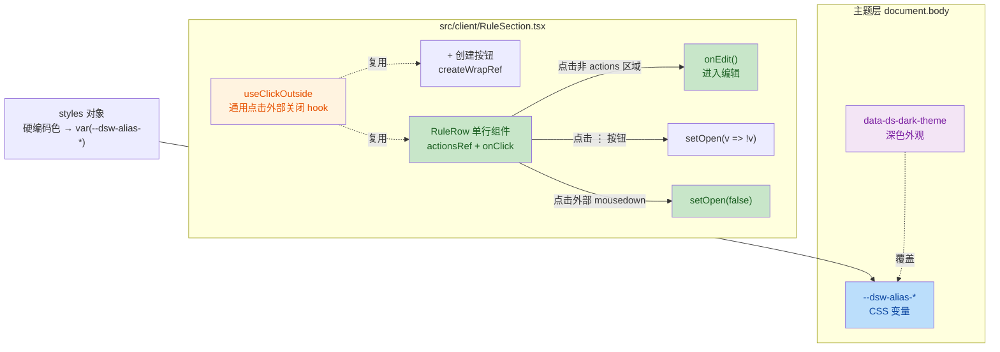

## 1. 高级摘要（TL;DR）

*   **影响**：**低**（纯客户端 UI/UX 优化，不涉及 host 逻辑、RPC 或构建管线）
*   **关键变更**：
    *   🖱️ **表项单击进入编辑**：双击 → 单击，并通过 `[data-rule-actions]` 数据属性守卫排除设置按钮区误触
    *   ✨ **新增通用 `useClickOutside` Hook**：监听文档级 `mousedown`，点击容器外自动关闭弹层（行设置菜单 + 「+ 创建」下拉复用）
    *   🌗 **配色全面接入 dsh 主题 Token**：`#fff` / `#d0d0d0` / `#2563eb` 等硬编码色全部替换为 `var(--dsw-alias-*)`，亮/深主题自动切换
    *   📝 **文档联动更新**：新增解决方案文档 + 变更记录，README 同步描述

---

## 2. 视觉概览（代码与逻辑地图）



---

## 3. 详细变更分析

### 3.1 通用 Hook 抽取（`useClickOutside`）

**文件**：`src/client/RuleSection.tsx`

**变更要点**：

*   新增泛型 Hook `useClickOutside<T extends HTMLElement>(active, onClose)`，返回 `RefObject<T | null>`
*   仅在 `active === true` 时挂载全局 `mousedown` 监听，避免无谓开销
*   使用 `mousedown`（而非 `click`）：保证在外部元素自身的 `click` 处理之前关闭，交互更跟手
*   组件卸载 / `active` 翻转时正确清理监听器

```tsx
function useClickOutside<T extends HTMLElement>(active: boolean, onClose: () => void): RefObject<T | null> {
  const ref = useRef<T>(null)
  useEffect(() => {
    if (!active) return
    const handler = (e: MouseEvent): void => {
      if (ref.current && !ref.current.contains(e.target as Node)) onClose()
    }
    document.addEventListener('mousedown', handler)
    return () => document.removeEventListener('mousedown', handler)
  }, [active, onClose])
  return ref
}
```

---

### 3.2 行编辑交互：双击 → 单击

**文件**：`src/client/RuleSection.tsx` → `RuleRow`

**问题**：原实现使用 `onDoubleClick` 触发编辑，体验不顺手；直接换为 `onClick` 会与设置按钮区（`⋮` + 菜单项）事件冒泡冲突。

**方案**：

*   `<li>` 改用 `onClick={handleRowClick}`
*   `rowActions` 容器加 `data-rule-actions` 数据属性
*   处理器内用 `closest('[data-rule-actions]')` 守卫：命中即放行（菜单/按钮自身有处理），未命中则进入编辑

```tsx
const handleRowClick = (e: ReactMouseEvent<HTMLLIElement>): void => {
  if ((e.target as HTMLElement).closest('[data-rule-actions]')) return
  onEdit()
}
```

---

### 3.3 点击外部关闭弹层（菜单 + 下拉）

| 位置 | 状态变量 | 绑定 Ref | 关闭动作 |
|:--|:--|:--|:--|
| 行设置菜单 | `open` | `actionsRef` (挂在 `rowActions` 容器) | `setOpen(false)` |
| 「+ 创建」下拉 | `createMenuOpen` | `createWrapRef` (挂在 `createWrap`) | `setCreateMenuOpen(false)` |

两处共用 `useClickOutside`，实现一致性关闭行为。

---

### 3.4 主题 Token 替换（深色模式适配）

**文件**：`src/client/RuleSection.tsx` → `styles` 对象

**问题根因**：`styles` 全部为硬编码颜色（如 `background: '#fff'`），而 dsh web 在深色外观下未接管这些样式，导致「白底白字」等视觉异常。

**修复思路**：将硬编码色替换为 dsh 在 `document.body` 上以 CSS 变量形式暴露的主题别名 token（`--dsw-alias-*`），深色时由 `data-ds-dark-theme` 属性自动覆盖。

| 样式键 | 原值（硬编码） | 新值（主题 Token） |
|:--|:--|:--|
| `intro.color` | `#888` | `var(--dsw-alias-label-tertiary)` |
| `tabs.borderBottom` | `#e0e0e0` | `var(--dsw-alias-separator-primary)` |
| `tabActive.borderBottom` | `#2563eb` | `var(--dsw-alias-brand-primary)` |
| `muted.color` | `#888` | `var(--dsw-alias-label-tertiary)` |
| `error.color` | `#dc2626` | `var(--dsw-alias-state-error-primary)` |
| `warn.color` | `#b45309` | `var(--dsw-alias-state-warn-primary)` |
| `row.border` | `#e5e5e5` | `var(--dsw-alias-border-l1)` |
| `fileIcon.background` | `#93c5fd` | `var(--dsw-alias-brand-primary)` |
| `rowMeta.color` | `#999` | `var(--dsw-alias-label-tertiary)` |
| `iconButton.color` | `#666` | `var(--dsw-alias-label-secondary)` |
| `menu.background` | `#fff` | `var(--dsw-alias-bg-layer-2)` |
| `menu.border` | `#d0d0d0` | `var(--dsw-alias-border-l1)` |
| `editor.background` | `#fafafa` | `var(--dsw-alias-bg-layer-1)` |
| `editor.border` | `#d0d0d0` | `var(--dsw-alias-border-l1)` |
| `ghostButton.background` | `#fff` | `var(--dsw-alias-button-ghost-active-fill)` |
| `ghostButton.border` | `#d0d0d0` | `var(--dsw-alias-border-l2)` |
| `ghostButton.color` | _（未设，继承白字）_ | `var(--dsw-alias-label-primary)` ⭐新增 |
| `primaryButton.background` | `#2563eb` | `var(--dsw-alias-button-primary-fill)` |
| `primaryButton.color` | `#fff` | `var(--dsw-alias-label-primary-inverted)` |
| `dangerButton.background` | `#dc2626` | `var(--dsw-alias-state-error-primary)` |
| `dangerButton.color` | `#fff` | `var(--dsw-alias-label-primary-inverted)` |

> ⭐ 关键修复：`ghostButton` 此前未显式设置 `color`，深色下出现「白底白字」；新增 `var(--dsw-alias-label-primary)` 显式声明文字色。

---

### 3.5 文档与变更记录

| 文件 | 性质 | 内容要点 |
|:--|:--|:--|
| `.trae/documents/解决方案：dsh规则设置页面交互与深色主题优化-001.md` | 新增 | 6 章节方案：现状与问题定位、根因分析、解决方案、影响与风险、验证方案、结论 |
| `docs/变更记录/20260827-1840.md` | 新增 | 当日变更概要 + 涉及文件 + 验证结果（typecheck/test/build 全过） |
| `README.md` | 修订 | 「管理界面」段同步更新交互与主题描述 |

---

## 4. 影响与风险评估

### 4.1 破坏性变更

*   ✅ **无 API 破坏**：`controller.ts`、`types.ts` 未触及，RPC 协议不变
*   ✅ **无 host 逻辑变更**：纯 client 端 `RuleSection.tsx` 内联样式与事件处理
*   ⚠️ **用户可见行为变化**：
    *   单击行即进入编辑（之前需双击）—— 行为更顺手，但属于用户可感知变化
    *   菜单/下拉在点击外部自动关闭 —— 符合通用 UI 习惯

### 4.2 兼容风险

*   **依赖 dsh 主题 Token 存在性**：若某 dsh 版本未定义某 `--dsw-alias-*` token，`var()` 解析失败会回退为无色/继承
*   **已核验**：当前 dsh 内置 `dsh-client-ui-theme` 定义全套别名 token，风险可控

### 4.3 测试建议

| 场景 | 验证点 |
|:--|:--|
| **P1 单击编辑** | 单击任一规则行 → 直接进入编辑态；单击 `⋮` → 只弹菜单，不进入编辑；点击「编辑」菜单项 → 进入编辑 |
| **P2 外部关闭** | 点 `⋮` 展开菜单 → 点击页面上列表外任意区域 → 菜单关闭；点「+ 创建」下拉 → 点击其他位置 → 下拉关闭 |
| **P3 深色主题** | dsh 外观切「亮」→ 刷新按钮浅色底、深色文字；切「深」→ 刷新按钮深色底、浅色文字（**不再白底白字**），列表/菜单/按钮/提示色随主题一致 |
| **回归** | `npm run typecheck` / `npm test`（现有 8/8 应保持）/ `npm run build` |
| **TypeScript 类型** | `MouseEvent as ReactMouseEvent`、`RefObject<T \| null>` 新类型导入需通过编译 |

### 4.4 部署提示

*   需将 `lib` / `client` 构建产物同步至 `D:\SOFTTOOLS\SOFTAI\deepseek-harness\Admin\Plugin\dsh-rules` 副本（`robocopy /MIR /XD node_modules .git .trae`）
*   web profile 的 rulebase 为 link 指向该副本，`lib` 更新即生效，无需 pnpm 重链接